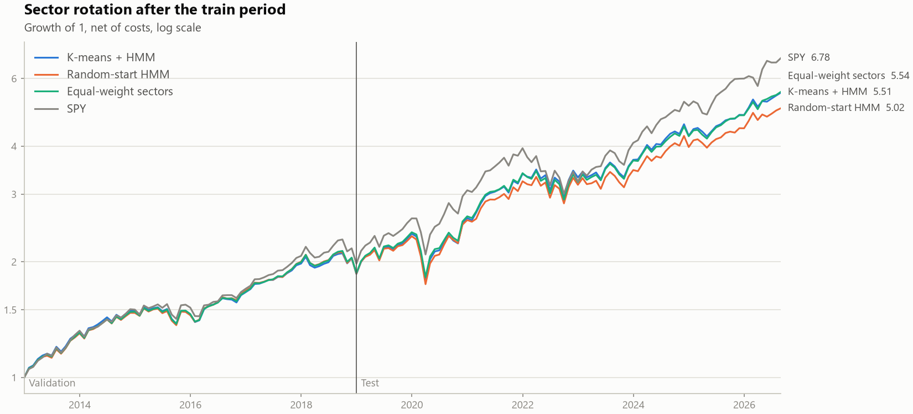
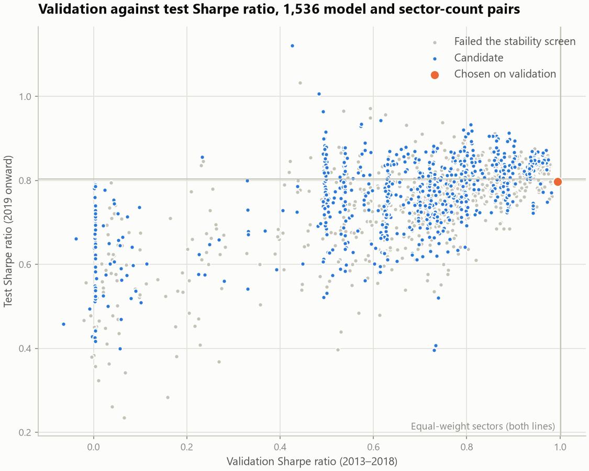
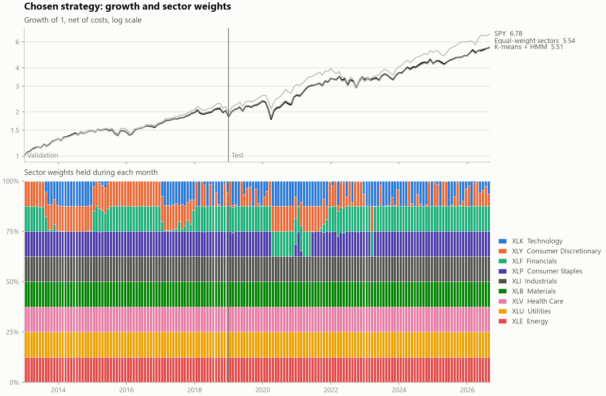
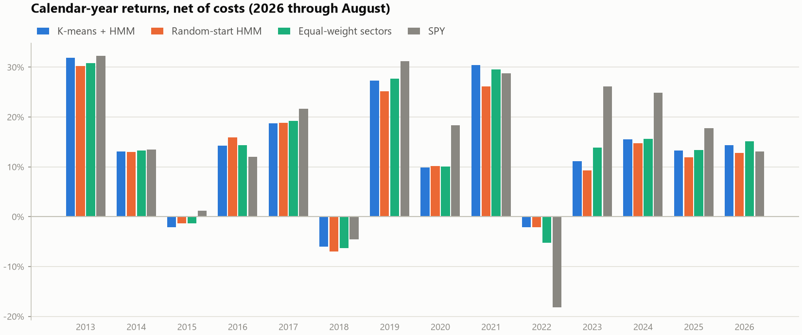
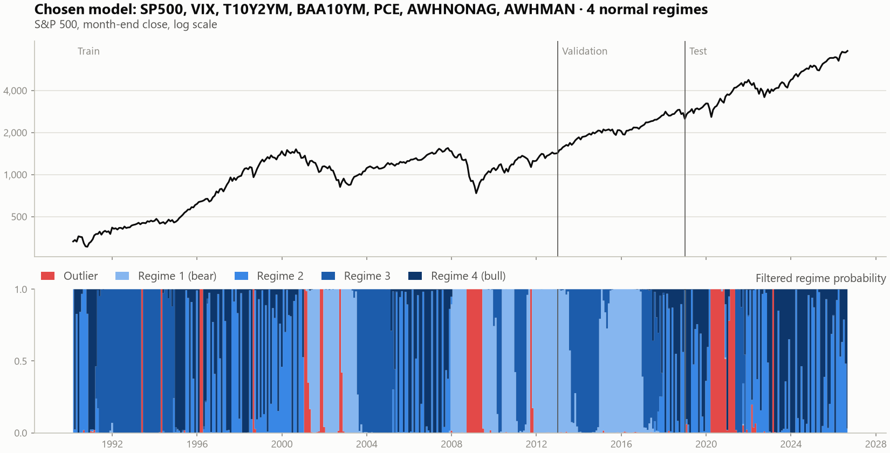

# K-means + HMM 하이브리드 레짐 모델과 섹터 로테이션 검증

미국 거시·시장 지표로 월별 레짐을 추정하고, 그 레짐으로 섹터 ETF를 고르는 전략이 표본 외에서 통하는지 검증한 프로젝트입니다.

- **아이디어**: HMM은 EM 알고리즘의 초기값에 따라 결과가 달라집니다. K-means 클러스터링으로 레짐 라벨을 먼저 만들고, 그 라벨에서 HMM의 초기 파라미터를 계산해 이 문제를 없앱니다. 같은 클러스터 중심은 학습 이후 구간에서 이상치 달을 걸러내는 데에도 씁니다.
- **절차**: 변수 조합 192개를 학습 구간에서 100번씩 클러스터링해 라벨이 매번 같은 모델만 후보로 남기고, 검증 구간에서 하나를 골라, 테스트 구간에서 평가합니다.
- **결론**: 초기값 문제는 해결됐습니다. 그러나 이 레짐 신호로 만든 섹터 로테이션은 2013년 이후 섹터 동일가중을 이기지 못했습니다.

데이터, 수식, 실험 설계, 전체 결과 표는 [상세 보고서](docs/report.md)에 있습니다.

## 결과

거래비용 편도 10bp를 반영한 월별 수익률 기준입니다. 모델과 섹터 개수는 검증 구간 Sharpe로만 골랐습니다.

| | 검증 Sharpe<br>(2013–2018) | 검증<br>연수익률 | 테스트 Sharpe<br>(2019–2026.08) | 테스트<br>연수익률 | 테스트<br>최대낙폭 |
|---|---|---|---|---|---|
| K-means + HMM | 0.99 | 10.9% | 0.80 | 15.2% | −24.8% |
| 랜덤 초기화 HMM | 1.00 | 10.9% | 0.72 | 13.8% | −25.0% |
| 섹터 9개 동일가중 | 1.00 | 11.0% | 0.80 | 15.2% | −23.6% |
| SPY | 1.06 | 12.0% | 0.90 | 17.4% | −23.9% |

선택된 모델은 `core+AWHNONAG+AWHMAN_r4`이고 레짐마다 섹터 8개를 담습니다. 이름의 뜻은 다음과 같습니다.

- **`core`**: 모든 모델에 들어가는 코어 변수 5개. S&P 500 월 수익률, VIX, 장단기 금리차(`T10Y2YM`), Baa 스프레드(`BAA10YM`), 개인소비지출 증가율(`PCE`)
- **`+AWHNONAG+AWHMAN`**: 이 모델에 추가한 선택 변수(민간·제조업 주당 근로시간의 변화)
- **`_r4`**: 정상 레짐 4개. 이상치 레짐을 더해 총 5개



읽는 법은 네 가지입니다.

1. **192개 조합 중 103개만 안정적이었습니다.** 시드를 바꿔 100번 클러스터링했을 때 라벨이 매번 같은 모델입니다. 정상 레짐 2개 모델은 64개 중 62개가 통과했지만 4개 모델은 10개만 통과했습니다.
2. **검증이 "신호를 쓰지 말라"고 답했습니다.** 후보 824개(103개 모델 × 섹터 수 1\~8) 중 검증 구간에서 동일가중을 이긴 것이 없습니다. 검증 Sharpe는 담는 섹터가 많을수록 오르고, 가장 큰 8개가 뽑혔습니다. 섹터가 9개뿐이므로 레짐마다 한 섹터만 빼는, 사실상 동일가중입니다.
3. **검증 성과는 테스트 성과를 알려주지 못했습니다.** 테스트에서는 동일가중을 넘는 후보가 많지만, 섹터 수를 고정하고 보면 검증 Sharpe와 테스트 Sharpe의 상관은 −0.15\~0.19입니다.
4. **K-means 초기화의 가치는 재현성입니다.** 랜덤 초기화 HMM은 같은 설정에서도 시작점 20개에 따라 검증 Sharpe가 평균 0.25만큼 벌어집니다(3개 섹터 기준). 하이브리드는 답이 하나입니다. 성과가 더 좋다는 일관된 증거는 없습니다.



선택된 전략의 누적 수익(위)과 매달 들고 있던 섹터 비중(아래)입니다. 아래 패널은 달마다 막대 하나로 비중을 100%로 쌓은 것이고, 위쪽 네 섹터 중 그 달에 제외된 섹터의 색이 사라집니다. 학습 구간(1999\~2012)에 부진했던 기술(XLK)을 자주 뺐는데, 기술은 검증과 테스트 구간 모두에서 가장 좋은 섹터였습니다. 레짐별 섹터 선택 근거와 연도별 수익률은 [상세 보고서 7.5\~7.6절](docs/report.md#75-섹터-포트폴리오-구성)에 있습니다.





## 방법

### 데이터

| 구분 | 출처 | 변수 | 변환 | 발표 시차 |
|---|---|---|---|---|
| 코어 | Yahoo, FRED | S&P 500, VIX, 장단기 금리차(`T10Y2YM`), Baa−국채 10년 스프레드(`BAA10YM`), `PCE` | 로그수익률, 수준, 로그 차분 | 시장 변수 없음, `PCE` 1개월 |
| 선택 | FRED | `INDPRO`, `PAYEMS`, `UNRATE`, `ICSA`, `AWHMAN`, `AWHNONAG` | 로그 차분, 차분 | 1개월 (`ICSA`는 주간 발표일 기준) |
| 섹터 | Yahoo | Select Sector SPDR 9개(XLB, XLE, XLF, XLI, XLK, XLP, XLU, XLV, XLY), SPY | 월 수익률 | — |

- 매크로 패널은 1990-02\~2026-08(439개월), 섹터 수익률은 1999-01\~2026-08(332개월)입니다. 2026-09-30에 받은 데이터입니다.
- **미래 정보 차단**: 모든 값은 "그 달 말에 실제로 발표돼 있던 값"으로 날짜를 다시 매깁니다. 예를 들어 2월 고용은 3월에 발표되므로 3월 말 행에 들어갑니다.
- 분기 지표(GDP, 설비투자)는 뺐습니다. 발표 시차를 적용하면 2020년 2분기 급락이 8월에야 반영됩니다.

### 레짐 모델

1. **표준화**: 학습 구간의 평균과 표준편차만 사용합니다.
2. **1차 클러스터링(이상치)**: 각 달이 학습 구간 평균에서 떨어진 거리를 K-means(k=2)로 나눕니다. 먼 쪽이 이상치 레짐이고, 두 군집의 경계가 이후 구간에서 쓰는 기준선입니다.
3. **2차 클러스터링(정상 레짐)**: 나머지 달을 L2 정규화한 뒤 K-means로 2\~4개로 나누고, S&P 500 평균 수익률 순으로 번호를 붙입니다(1 = 약세, 마지막 = 강세).
4. **HMM 초기화와 EM**: 라벨에서 초기확률, 전이행렬(라플라스 스무딩), 레짐별 평균과 공분산을 계산해 Gaussian HMM의 시작점으로 주고 EM을 돌립니다. 이상치 레짐은 표본이 적어 공분산은 각 레짐의 대각 성분 쪽으로 축소해 추정합니다.
5. **월별 필터링**: 새 달이 기준선을 넘으면 이상치 레짐 확률을 1로 둡니다. 아니면 전월 확률 × 전이행렬 × 방출확률로 레짐 확률을 갱신합니다. 전이행렬은 K-means 라벨의 전이 횟수로 만들고 매달 한 건씩 늘려 갑니다.

선택된 모델의 레짐 확률입니다. 학습 구간의 레짐별 S&P 500 월평균 수익률은 이상치 −3.1%, 레짐 1\~4가 −1.4%, +0.5%, +1.9%, +2.0%입니다.



### 후보와 검증 설계

- **구간**: 학습 1990-02\~2012-12, 검증 2013-01\~2018-12, 테스트 2019-01\~2026-08.
- **조합**: 코어 5개 + 선택 변수 6개의 모든 부분집합(64개) × 정상 레짐 2\~4개 = 192개 모델.
- **안정성 선별**: 모델마다 시드 0\~99로 2단계 K-means를 100번 돌려, 학습 구간 라벨이 100번 모두 같은 모델만 후보로 남깁니다.
- **레짐별 포트폴리오**: 학습 구간(섹터 ETF가 있는 1999\~2012년)에서 각 레짐 다음 달 평균 수익률이 높았던 섹터 N개를 동일가중으로 담습니다.
- **매달 비중**: 월말 레짐 확률로 레짐별 포트폴리오를 섞어 다음 달에 보유합니다.
- **비용**: 회전율 1단위당 10bp. 회전율은 수익률로 변한 직전 비중을 기준으로 계산합니다.
- **선택**: 후보 모델과 N(1\~8)을 검증 Sharpe로 함께 고릅니다.
- **비교 모델**: 같은 변수·같은 레짐 수의 HMM을 무작위 시작점 20개에서 학습하고 표준 forward 필터를 씁니다. 설정마다 학습 우도가 가장 높은 시작점을 대표로 삼아 같은 절차로 고릅니다.

## 한계와 공개 사항

- **테스트 구간을 본 시점**: 개발 중 테스트 결과를 본 뒤에 두 가지를 바꿨습니다. 섹터 수를 3개 고정에서 검증 선택으로, 후보를 손으로 정한 12개에서 안정성 선별을 통과한 103개로 바꿨습니다. 어느 구성에서도 검증 구간에서 동일가중을 이긴 후보는 없었습니다.
- **수정된 데이터 사용**: 발표 시차는 반영했지만 값은 최신 수정치입니다. 당시에 발표된 속보치(빈티지)가 아닙니다.
- **발표 시차는 근사**: 지표별로 고정 시차를 썼습니다. 실제 발표일이 달을 넘긴 경우는 반영하지 못합니다.
- **표준화 기준 고정**: 2012년까지의 평균과 표준편차를 계속 쓰므로, 이후 값의 분포가 달라지면 레짐 분류도 달라집니다.
- **표본**: 섹터 ETF 9개, 검증 72개월, 테스트 92개월입니다. Sharpe 0.1 안팎의 차이는 통계적으로 구분되지 않습니다.

## 재현 방법

Python 3.11 이상이 필요합니다.

```
python -m venv .venv
.venv\Scripts\activate            # macOS/Linux: source .venv/bin/activate
pip install -e ".[dev]"

pytest -q                                  # 테스트 17개
python scripts/01_download_data.py         # FRED(API 키 불필요) + Yahoo → data/raw/
python scripts/02_build_panel.py           # 발표 시차 적용 패널 → data/processed/
python scripts/03_screen_stability.py      # 192개 모델 × 100회 안정성 선별 (16코어에서 약 17분)
python scripts/04_fit_regimes.py           # 192개 모델 학습, 레짐 확률과 차트 → results/
python scripts/05_backtest.py              # 백테스트, 검증 선택, 벤치마크 → results/backtest/
```

데이터는 저장소에 넣지 않았습니다. FRED는 값을 수정하고 Yahoo는 조정 종가를 다시 계산하므로, 새로 받으면 수치가 조금 달라질 수 있습니다.

## 구조

```
src/regime_hmm/
  config.py      변수·변환·발표 시차, 구간, 모델 조합 등 모든 설정
  data.py        다운로드, 발표 시차를 적용한 월말 패널
  model.py       2단계 K-means, 안정성 측정, HMM 초기화와 EM, 월별 필터
  baseline.py    랜덤 초기화 HMM과 표준 forward 필터
  backtest.py    레짐별 포트폴리오, 비용 반영 시뮬레이션, 성과 지표
  plots.py       차트
scripts/         01~05 단계별 실행 스크립트
tests/           미래 정보 차단, 필터, 비용 계산 테스트
results/         안정성 선별 결과, 레짐 요약, 백테스트 표와 차트
docs/            상세 보고서
```

## AI 활용

이 프로젝트는 Anthropic의 Claude(Claude Code)와 함께 만들었습니다.

| 구분 | 내용 |
|---|---|
| 작성자 | K-means 라벨로 HMM을 초기화한다는 아이디어, 실험 절차 설계(192개 조합, 100회 안정성 선별, 학습 이후 구간의 월별 갱신), 학습 구간·변수·검증 방식 등 주요 결정, 결과 검토와 방향 지시 |
| Claude | 코드 구현과 테스트, 발표 시차·이상치 규칙·공분산 축소 등 방법 제안, 실험 실행과 결과 분석, 그림 제작, README와 보고서 초안 |

코드와 문서의 대부분은 Claude가 작성했고, 설계와 의사결정, 결과 검토는 작성자가 했습니다. 모든 수치와 그림은 저장소의 스크립트로 다시 만들 수 있습니다.
